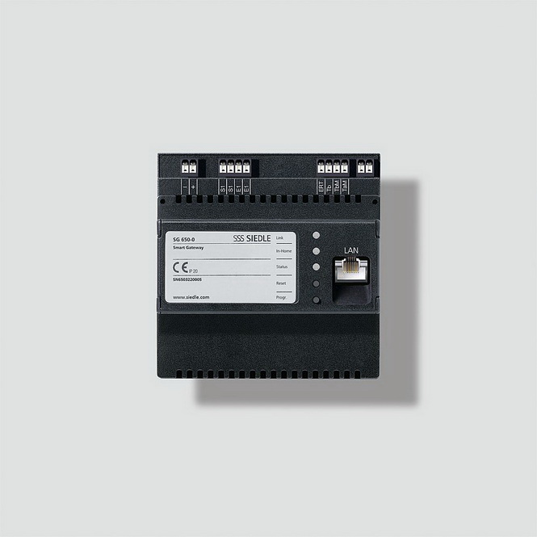

# SIEDLE SG 650-0 Smart Gateway Professional

 

The SIEDLE SG 650-0 Smart Gateway Professional contains components licensed under various open source licenses, including the GNU GENERAL PUBLIC LICENSE Version 2.

The software in this repository has been provided by S. Siedle & Söhne Telefon- und Telegrafenwerke OHG in response to a request for receiving the source code of the open source components used in the SIEDLE SG 650-0 Smart Gateway Professional. 

It is merely mirrored here in the hope that it is useful for easier searching and reference. The maintainer of this GitHub repository is not affiliated in any way to S. Siedle & Söhne Telefon- und Telegrafenwerke OHG. 

Please direct any questions regarding this software directly to S. Siedle & Söhne Telefon- und Telegrafenwerke OHG, Bregstraße 1, 78120 Furtwangen, Germany.